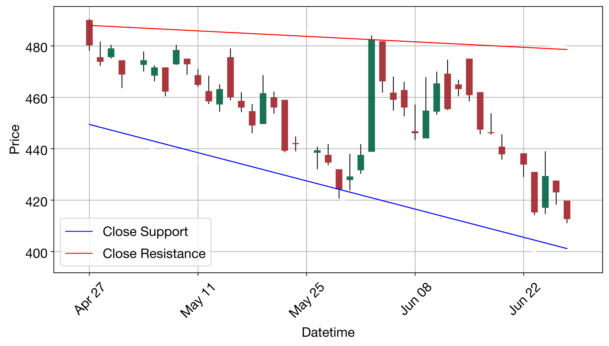

# Quant Agent VLM HKAI

HK stock quantitative trading agent — LLM screening + technical analysis + **VLM chart reading** + automated execution.

5 LLM/VLM agents collaborate: screening, indicator analysis, pattern recognition, trend analysis, final decision. Fully automated.

## Highlight: VLM Chart Analysis

Traditional quant only computes indicators. This agent renders candlestick charts and feeds them to a Vision Language Model (VLM), letting it "look at the chart" like a human trader.

**Trendline chart → VLM analyzes support/resistance/breakout direction:**



> VLM output: *"Support (blue) is steeply downward-sloping, price has broken below support line decisively — confirmed breakdown. Resistance (red) has held firm with repeated rejections. Lower highs + lower lows = accelerating downside. Prediction: **Downward**."*

Same approach for K-line charts: VLM identifies 16 classic candlestick patterns (Head & Shoulders, Double Bottom, Pennant, V-Reversal, etc).

## 5-Agent Pipeline

```
Stock Screening                     VLM
  │  Scans all HK stocks, picks top 2
  ▼
Technical Indicators                VLM
  │  TA-Lib: RSI / MACD / Stoch / ROC / Williams %R
  │  LLM interprets signals, divergences, crossovers
  ▼
┌──────────────┬──────────────┐
│ Pattern      │ Trend        │     VLM × 2
│ K-line chart │ Trendline    │
│ → VLM reads  │ → VLM reads  │
│ 16 patterns  │ support/resist│
└──────────────┴──────────────┘
  ▼
Final Decision                      VLM
  │  Synthesizes 3 reports → LONG / SHORT / HOLD
  │  + risk/reward ratio + forecast horizon + rationale
  ▼
Trade Execution
  │  LONG → buy_stock()  /  SHORT → sell_stock()
```

- **Screening**: Fetches all HK stocks via `list_selectable_stocks` + `get_quote_by_symbols`, LLM picks top 2 by momentum, liquidity, volatility
- **Indicators**: TA-Lib computes 5 technical indicators, LLM writes analysis report
- **Chart Reading**: mplfinance renders trendline + K-line charts, VLM (qwen3-vl-plus) analyzes support/resistance and identifies patterns
- **Decision**: Synthesizes indicator + pattern + trend reports, outputs trade signal with risk/reward and forecast
- **Execution**: Calls HK AI API to place orders — calculates position size from available cash, sells existing holdings

## Run

**Requires a VLM (vision-capable) model.** All 5 agents — including the two that read candlestick charts — share the same model. On the fintools platform, select a VLM model (e.g., `qwen3-vl-plus`, `gpt-4o`).

```bash
python main.py              # auto screen → analyze → trade
python main.py 00388.HK     # specify a stock
```

### Environment Variables

| Variable | Description |
|----------|-------------|
| `HKAI_MCP_TOKEN` | HK AI competition token |
| `DASHSCOPE_API_KEY` | DashScope API key (local dev) |
| `OPENAI_API_KEY` / `OPENAI_BASE_URL` / `LLM_MODEL` | Platform-injected (cloud) |

## Architecture

5 agents built with LangGraph StateGraph, each powered by a dedicated LLM prompt. Two VLM agents render charts via mplfinance + TA-Lib, then invoke qwen3-vl-plus for visual analysis. Trade execution wraps the HK AI MCP trading API with position sizing and risk limits (min 10 shares, max HK$500k per order).

