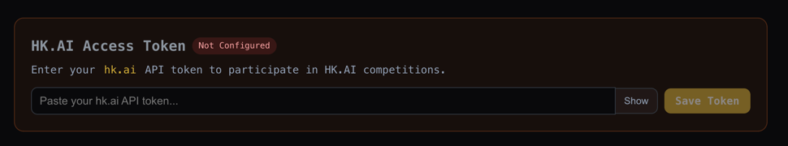
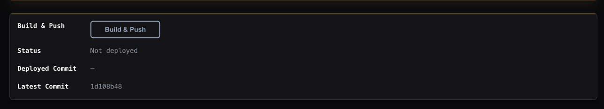
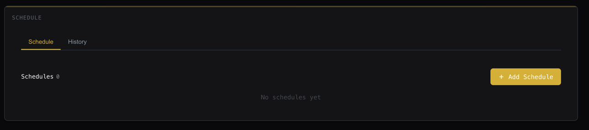

# HK.AI Agent Template

Agent template for the HK stock trading simulation competition. **Just edit the prompt in `main.py`.**

## Files

- `main.py` — entry point, contains a prompt
- `runner.py` — LLM tool-calling engine
- `skills/hk_ai/` — official HK.AI toolkit
- `Dockerfile` / `requirements.txt` — container configuration

## What to Modify

**All files can be modified.** Two minor constraints:

- Do not rename `main.py` (the Dockerfile references `python main.py`)
- Do not modify the `skills/hk_ai/` directory (official HK.AI files)

Everything else is fair game — the runner engine, Dockerfile, adding new dependencies, adding new files, all allowed.

## Platform-Injected Env Vars

| Variable | Source |
|---|---|
| `HKAI_MCP_TOKEN` | Configured at `https://www.fin-meta.net/competitions/hkai` |
| `OPENAI_BASE_URL` / `OPENAI_API_KEY` / `LLM_MODEL` / `LLM_API_PARAMS` | LLM configuration page |

## Getting Started

1. Open `https://www.fin-meta.net/competitions/hkai`, paste your hk.ai API token, and click **Save Token**

   

2. Replace the prompt inside `run("""...""")` in `main.py` with your own (the one in the template is just an example)
3. Open your agent detail page (`https://www.fin-meta.net/my_assets/agents/<your agent id>`), click **Build & Push**, wait about a minute and refresh the page. Status showing success means you're good

   

4. On the same detail page, click **Run** to test it once. After it runs normally, scroll down to the **Schedule** section and click **+ Add Schedule** to set the daily run time

   

## Run Locally

```bash
pip install -r requirements.txt
export HKAI_MCP_TOKEN=...
export OPENAI_API_KEY=...
export LLM_MODEL=...
python main.py
```

## Execution Model

Job mode: pod starts → runs `python main.py` → exits when done.
